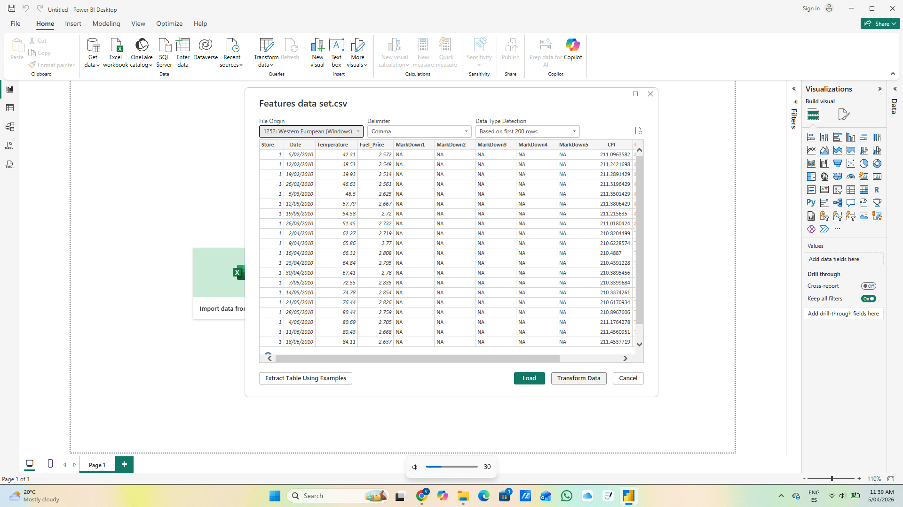
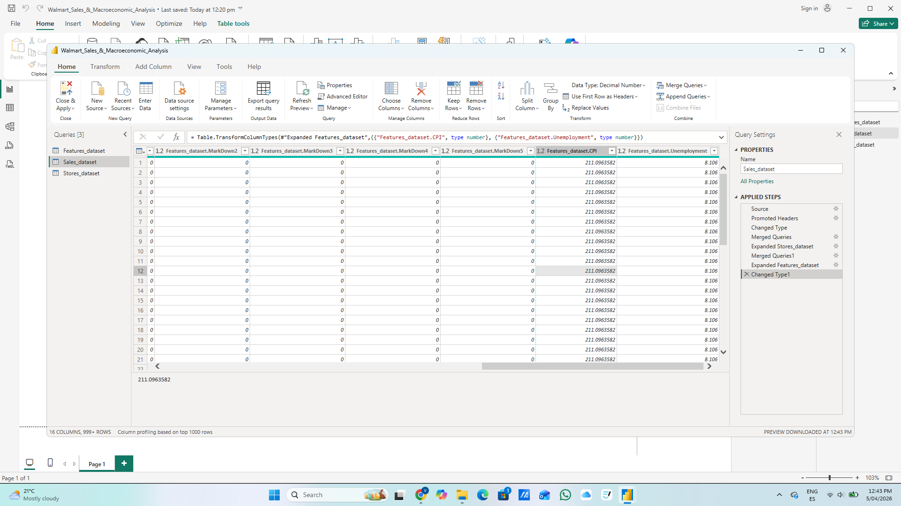
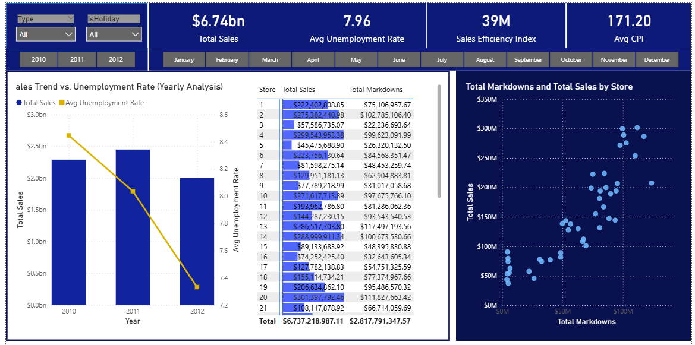
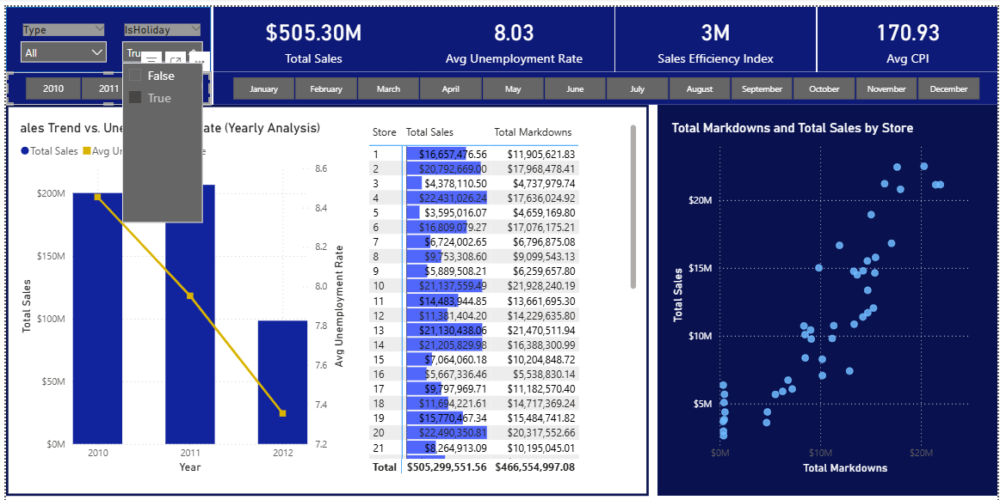

# Walmart Strategic Sales & Macroeconomic Analysis

### Project Overview
This project explores the relationship between historical retail sales and external factors such as **promotional markdowns**, **Consumer Price Index (CPI)**, and **unemployment rates**. 

As an Economist transitioning into Data Analytics in Sydney, I developed this dashboard to demonstrate how data-driven insights can optimize operational decision-making in a large-scale retail environment.

---

### Tech Stack & Skills
* **Tool:** Power BI Desktop
* **Process:** ETL (Extract, Transform, Load) using **Power Query**.
* **Key Skills:** Data Modeling (Star Schema), Advanced DAX, Data Visualization, Macroeconomic Trend Analysis.

---

###  Data Preparation & Modeling
Before the analysis, I managed the end-to-end data pipeline to ensure accuracy:
* **Cleaning:** Handled missing values (NA) in promotional markdowns and standardized date formats.
* **Integrity:** Merged 3 relational datasets (Sales, Features, and Stores) into a unified Star Schema for optimized performance.

#### **ETL Process & Data Architecture:**

*Initial stage: Identifying and handling null values in promotional data.*

*Final Data Model: Implementing relationships between Sales, Features, and Store datasets.*

---

### Executive Dashboard & Interactive Analysis
The final dashboard provides a high-level view of the **$6.74bn total revenue** while allowing granular deep-dives into specific stores and economic conditions.

*The main interface features a high-contrast design for executive decision-making.*

#### **Advanced Feature: Dynamic Tooltips**
To provide instant context without cluttering the main view, I developed a custom Report Page Tooltip. When hovering over the scatter plot, the user can see a specific store's promotional mix (MD1-MD5) alongside its local CPI and Unemployment rate.

*Interactive tooltip showing promotional breakdown (MD1: 22M) and macroeconomic context for specific stores.*

---

### Business Questions & Strategic Answers

**1. How do macroeconomic factors impact the $6.74bn total revenue?**
The analysis reveals that as the Average Unemployment Rate dropped from 8.4 in 2010 to 7.4 in 2012, sales remained resilient. The $6.74bn revenue is more sensitive to CPI fluctuations than to local labor market shifts.

**2. Which promotional strategy (Markdowns) drives the most value?**
Using the tooltip deep-dive, I identified that **Markdown 1 (MD1)** is the primary driver for high-performing stores. In contrast, stores with lower sales often over-rely on MD4, suggesting a need to realign promotional strategies.

**3. Are holidays significantly impacting performance?**
By applying the "IsHoliday" filter, the data confirms a significant revenue lift during holiday weeks ($505M in specific periods). However, the trend chart shows that sales efficiency must be managed closely against rising fuel prices during these peaks.

*Drilling down into holiday performance and seasonal trends.*

**4. Which stores are the top contributors?**
The dashboard identifies "Power Stores" (e.g., Stores 4, 14, and 20) that consistently exceed $280M. Management can use this to replicate their promotional mix (MD1/MD5 focus) in underperforming regions.

---
*Developed by: [Your Name/GitHub Username]*
*Location: Sydney, Australia*
